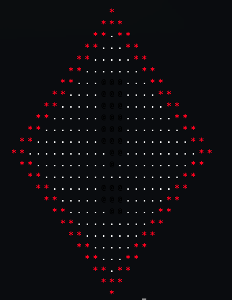

# CduASCII

*CduASCII* is a program who let you transform .jpeg and .png file into ascii in your terminal.

*(Yes the name means "It's ASCII" but in french 🇫🇷)*

### Example

| Original images    | Render Images      |
| ------------- | ------------- |
|  |  |
|  |  |

### How to use it ?

It's kind of simple you just need to get `gcc` and run one command *(if you didn't already have it)*

#### With `Makefile`:

You can if you want, create the executable your self. For this you need to execute those commands: 

```bash
git clone https://github.com/squach90/CduASCII.git
cd CduASCII
make
```
And run it with:
```bash
./cduascii
```
---

#### With `./cduascii` (The simplest):

```bash
git clone https://github.com/squach90/CduASCII.git
cd CduASCII
./cduascii
```

**And boom you can try this tools with all your images !**

## Dependencies

- **[stb_image](https://github.com/nothings/stb)** – image loader (`stb_image.h`)  
- **[file_browser](https://github.com/squach90/chip8-cpp/blob/main/src/file_browser.cpp)** (originally in cpp) – file selection helper (`file_browser.c/.h`)  
- **Standard C** – `stdio.h`, `stdlib.h`, `string.h`, `stddef.h`  
- **POSIX / Terminal** – `sys/ioctl.h`, `unistd.h`, `dirent.h`, `termios.h`, `sys/stat.h`, `limits.h`

> Anyone is free to copy, modify, publish, use, compile, sell, or distribute this software, either in source code form or as a compiled binary, for any purpose, commercial or non-commercial, and by any means.